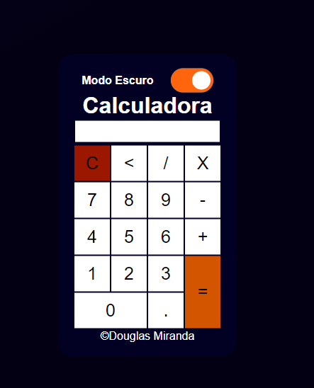

<h1> Calculadora 1.0</h1>

<h3> Esse Projeto foi desenvolvido utilizando: </h2>

<ul>
    <li>HTML</li>
    <li>CSS</li>
    <li>JavaScript</li>
</ul>

<h3>Design</h3>

<h4>Light Mode</h4>

<h4>Dark Mode</h4>

